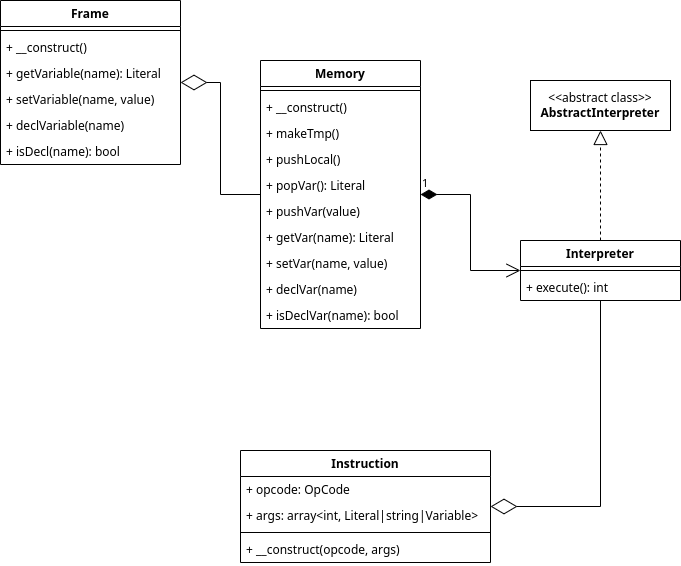

# Implementační dokumentace k 2. úloze do IPP 2023/2024

Jméno a přijmení: **Jakub Antonín Štigler**

Login: **xstigl00**

Implementaci jsem rozdělil do několika souborů:
- `ErrorCode.php`: obsahuje chybové kódy
- `Frame.php`: obsahuje třídu pro reprezentaci paměťového rámce
- `FrameType.php`: obsahuje enumeraci pro všechny typy rámců
- `Instruction.php`: obsahuje třídu reprezentující instrukci
- `Interpreter.php`: hlavní soubor kde probíhá interpretace. Obsahuje
  implementaci jednotlivých instrukcí.
- `InterpreterException.php`: třída vyjímek které hází můj kód. Dědí po
  `IPPException`
- `Literal.php`: obsahuje třídu reprezentující hodnotu a její typ.
- `Memory.php`: obsahuje třídu reprezentující paměťový model IPPcode24
- `OpCode.php`: obsahuje enumeraci všech instrukcí a jejich textovou
  reprezentaci
- `Variable.php`: obsahuje třídu reprezentující proměnnou
- `VarType.php`: obsahuje enumeraci datových typů v jazyce IPPcode24
- `XmlReader.php`: obsahuje funkce pro načtení instrukcí z XML

Při psaní kódu jsem pro propagaci chyb používal výhradně vyjímky a to vyjímky
typu `InterpreterException`.

## Rozdělení do tříd

### `Interpreter`
Toto je hlavní třída interpreteru. Udržuje stav interpreteru (jako je
například pozice v kódu nebo zásobník volání) a stav paměti interpretovaného
programu. Tato třída také v privátních metodách obsahuje implementaci všech
možných instrukcí jazyka IPPcode24.

### `Memory`
Třída `Memory` obsahuje stav paměti interpretovaného programu a poskytuje
rozhraní pro práci s touto pamětí. Veškeré metody pro prácí s pamětí hlídají
různě nesprávné použití a vyhazují vyjímky při nesprávném použití.

### `Frame`
Tato třída reprezentuje paměťový rámec v jazyce IPPcode24 a poskytuje metody
pro práci nad proměnnými v tomto rámci které kontrolují chybné použití.

### `Variable`
Třída reprezentující proměnnou v jazyce IPPcode24 - ukazuje do paměti v třídě
`Memory` pomocí identifikátoru a typu paměťového rámce.

### `Literal`
Tato třída reprezentuje hodnotu v paměti. Může mít jeden z povolených typů a
samotnou hodnotu, nebo může být paměť označena za neinicializovanou.

### `Instruction`
Toto je třída která reprezentuje kód jazyka IPPcode24 v paměti. Reprezentuje
volání instrukce. Obsahuje typ instrukce a její argumenty. Při konstrukci
třídy `Instruction` se kontroluje že argumenty jsou validní pro danou
instrukci tak moc jak jen to jde kromě konkrétních hodnot argumentů (kontrole
se počet argumentů, typy argumentů (*var*/*symb*/*label*) a datové typy pokud
jsou v tuto chvíli známé (to je když je argumentem literál)).

## Interpretace
Interpretace probíhá v třídě `Interpreter` pomocí opakovaného volání metody
`runNext` která spustí další instrukci a vrátí `true` pokud má program
pokračovat, nebo `false` pokud program došel na konec kódu nebo byla spuštěna
instrukce `EXIT`.

Kód je uložený v privátním atributu `$instructions`, je to souvislé pole kde se
indexuje pomocí `int` od `0`. Pozice v kódu se ukládá v privátním atributu
`$nextInst` jako pozice další instrukce která se má spouštět. Skokové instrukce
můžou tento atrubut měnit a tím skočit na jinou pozici v kódu.

Aby bylo jasné kde v kódu se nachází jednotlivá návěští, tak atribut
`$jumpTable` obsahuje mapu z názvu návěští na pozici v kódu. Pří skákání pomocí
instrukcí `CALL` a `RETURN` se využívá zásobníku volání který je uložen v
atributu `$callStack`.

## Čtení z XML
Pro čtení z XML se využívá funkce `read_instruction` která je implementovaná
v souboru `XmlReader.php`. Tato funkce bere jako argument XML dokument a vrací
souvislé pole instrukcí indexováno pomocí `ind` od `0`. Taky se zde při
vyplňuje tabulka skoků která je do funkce předána pomocí reference jako
výstupní argument.
